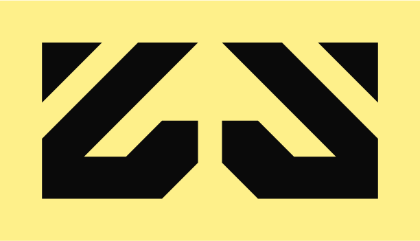
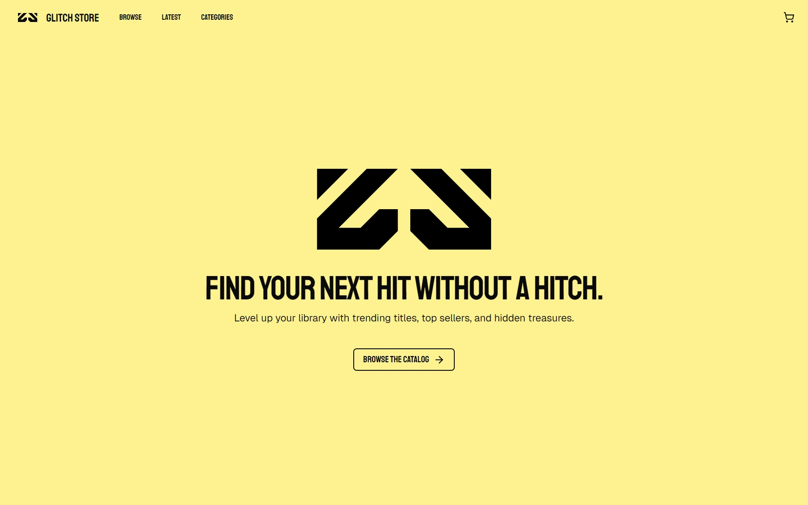
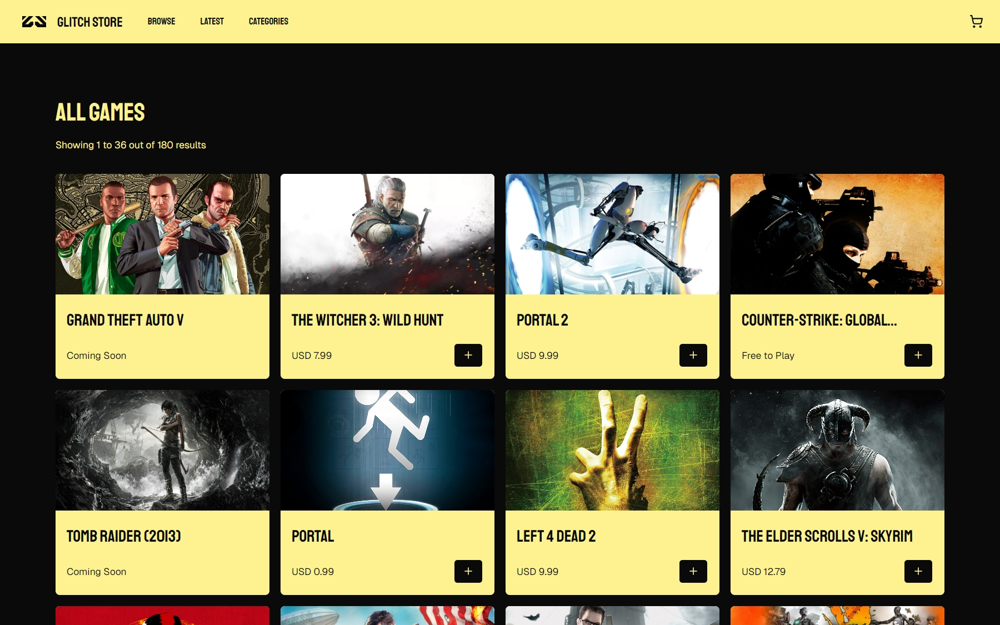
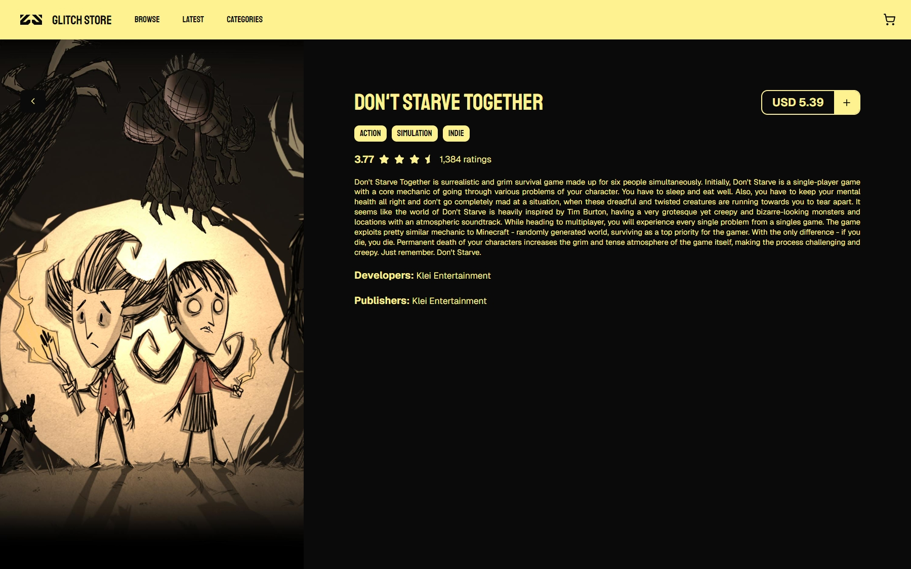
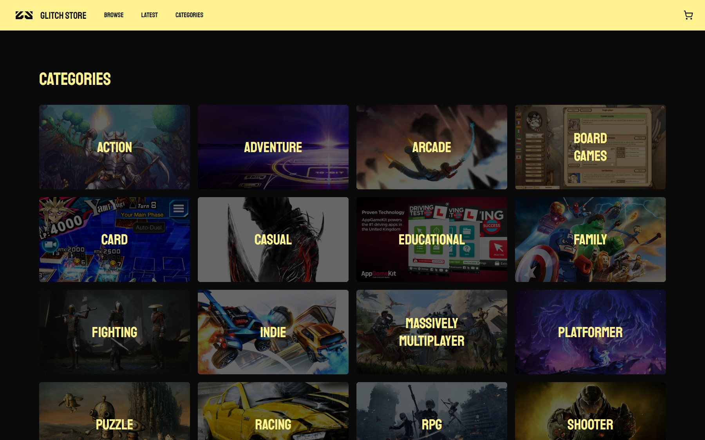

<div align="center">
  

  ### Glitch Store by [mariware](https://github.com/mariware)
  Find your next hit without a hitch. [Live Demo: Glitch Store](https://glitch-store-by-mariware.vercel.app)
</div>

## 📖 Features 

**Glitch Store** is a mock digital game store that lets users explore a curated catalog of titles, view detailed game pages, and simulate the checkout process. All game metadata is provided by the **RAWG API**, while up-to-date pricing information is sourced from **NEXARDA**.

- 🕹️ **Game Catalog**: Browse a regularly updated list of games.  
- 💰 **Accurate Pricing**: Prices sourced directly from NEXARDA.  
- 📄 **Game Details**: View descriptions, genres, and more on dedicated pages.  
- 🛒 **Cart & Checkout**: Add games to cart, calculate totals, and test a mock checkout flow.  
- 🎨 **Responsive Design**: Works seamlessly across desktop, tablet, and mobile.

## 🚀 Tech Stack

This project is built with  [**React**](https://react.dev/) for component-based UI and  [**Next.js**](https://nextjs.org/) as the framework for server-side rendering and fast applications. It is styled with  [**TailwindCSS**](https://tailwindcss.com/) along with [**shadcn/ui**](https://ui.shadcn.com/) for accessible, prebuilt UI components. The app uses  [**Redux Toolkit**](https://redux-toolkit.js.org/) for state management. Game metadata is fetched from [**RAWG API**](https://rawg.io/apidocs), while price data comes from the [**NEXARDA**](https://www.nexarda.com/).  

## 📦 Installation

Clone the repository:

```bash
git clone https://github.com/yourusername/resume-builder.git
cd resume-builder
```
Install dependencies:

```bash
npm install
```

Run the development server:

```bash
npm run dev
```

The app will be available at `http://localhost:3000`.

## 📸 Screenshots

<div align="center">
  
  
  
  
</div>

## 📝 Notes

This project was created as part of [The Odin Project's Full Stack Course](https://www.theodinproject.com/lessons/node-path-react-new-shopping-cart). It is intended as a practice project. As such, no actual purchases are processed. All game and price data belongs to their respective providers